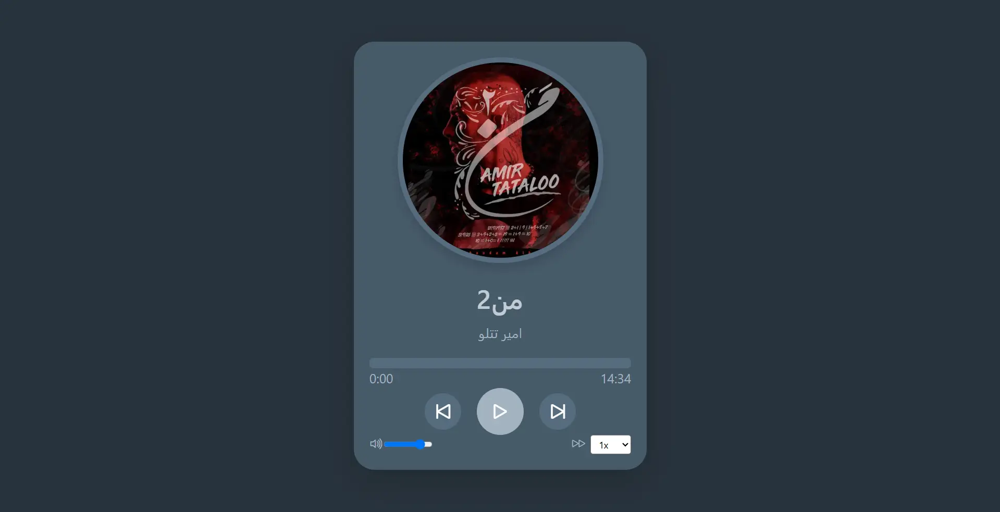

# 🎵 Music Player

A simple music player built with **HTML, CSS, JavaScript, and Bootstrap**.

## 🚀 Features

* Play and pause songs
* Next and previous song controls
* Display song title, singer, and cover image
* Interactive song progress bar
* Seek to a specific part of the song
* Volume control
* Playback speed control
* Automatically play the next song
* Responsive design

## 🛠️ Technologies

* HTML5
* CSS3
* JavaScript (Vanilla JS)
* Bootstrap 5
* Bootstrap Icons
* HTML5 Audio API

## Project Preview

## Live Demo

[View Live Demo](https://hosseinmehrbakhsh.github.io/music-player/)

## 🎯 Purpose

This project was created as a practice project while learning **JavaScript**, with a focus on:

* DOM manipulation
* Event handling
* JavaScript arrays and objects
* HTML5 Audio API
* Managing application state
* Working with audio events